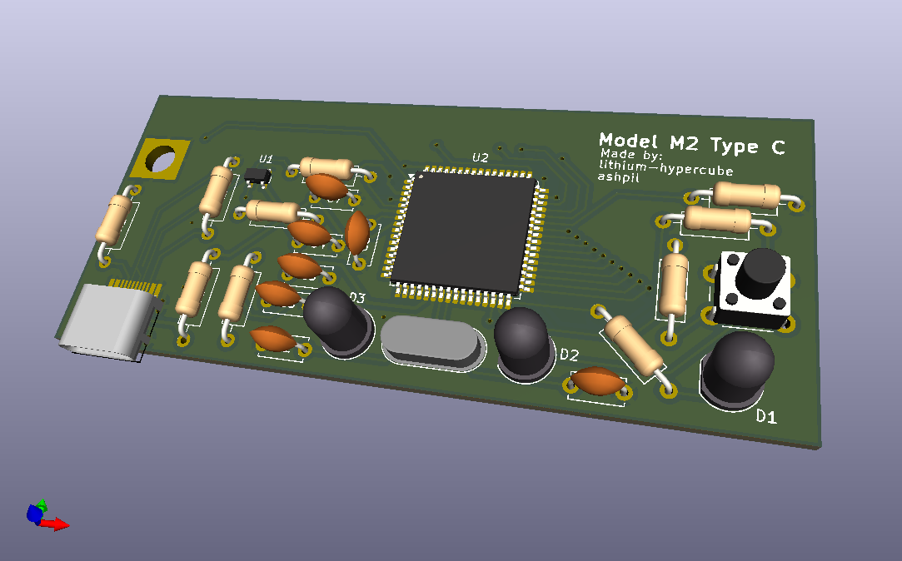

# Model M Type C
This project is a new board for the IBM model M2 that supports USB C

## Features
- USB C
- Has QMK and its features (allows key remapping)
- Less power draw (probably)
- Open source

## Usage
1. Print the board either using a cheap foreign service such as [JLCPBC](https://jlcpcb.com/ "JLCPBC") for around $2-6 + shipping, or a domestic service such as [OSH Park](https://oshpark.com/ "OSH Park") for around $22.
2. Acquire the components

|Reference|Type     |Value         |Qty|Link                           |
|---------|---------|--------------|---|-------------------------------|
|C1,C2    |Capacitor|22pF          |2  |                               |
|C3       |Capacitor|1uF           |1  |                               |
|C4,C5,C6 |Capacitor|0.1uF         |3  |                               |
|C7       |Capacitor|10uF          |1  |                               |
|D1,D2,D3 |LED      |Green, 3.3v   |3  |                               |
|F1       |Fuse     |500mA         |1  |https://mou.sr/447NG73         |
|R1,R2    |Resistor |5.1k          |2  |                               |
|R3,R4    |Resistor |22            |2  |                               |
|R5,R6    |Resistor |10k           |2  |                               |
|R7,R8,R9 |Resistor |270           |3  |                               |
|SW1      |Button   |              |1  |                               |
|U1       |ESD Diode|PRTR5V0U2X    |1  |https://mou.sr/3vXlnaQ         |
|U2       |Chip     |AT90USB1286-AU|1  |https://mou.sr/4kNduMC         |
|Y1       |Crystal  |16MHz         |1  |https://mou.sr/4ebH8ZG         |
|USB1     |Port     |USB C 12 pin  |1  |[keeb.io link](https://keeb.io/products/usb-c-port-12-pin-hro-type-c-31-m-12 "USB C hro female port")|
|         |Screw    |Screw         |1  |Harvest this from the old board|
3. Put it together. It's possible to solder the SMD components manually with a soldering iron, but if you are able to find a hot air gun or a reflow oven, it'll be significantly easier. Reference the visual BOM to see what goes where (it is located in bom/ibom.html).
	- You should have balls of solder instead of point on the underside of the PCB to not damage the membrane. To do this:
		1. Solder the components to the board normally
		2. Use side cutters to cut away the solder/remaining component legs on the underside. Try to cut close to the PCB but don't damage the traces.
		3. Add more solder/flux to the pad. Try to get a smooth blob of solder. Don't add too much though
5. Install firmware and test the board by shorting some pads
6. Cut the keyboard's case to make the USB C connector hole larger (I used a fretsaw to do this)

The traces on the membrane might have corroded with time. use a multimeter to check for connectivity. Note that trace resistance might be high, so the multimeter might not make a sound even if there is a connection. Try not to scratch the membrane pins. I used conductive copper tape (as in, the sticky side is also conductive) to repair damaged traces on mine.
The exposed traces on the membrane that touch the board did not connect well on mine. Try putting copper tape on that part of the traces. Pushing down the board might temporarily resolve the problem.

## Firmware
This board is fully compatible with QMK. QMK firmware has not been merged yet (probably). I will add a link to my fork with the new configuration. Please remind me if I forget
Note that the firmware only supports the ANSI layout, but you can probably fix that pretty easily if you have access to the ISO one (I don't). Most keys should work even if you use the wrong one.

## Other
If you have any problems/comments, or find anything that could be improved, please submit issue or a pull request!
